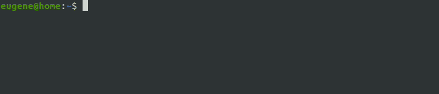

# BusyScout

BusyScout is a utility for interacting with BusyBox-based devices (IP cameras, NVRs) over telnet — file uploads and architecture fingerprinting.

## Table of Contents

- [Introduction](#introduction)
- [Usage](#usage)
  - [Push — file upload](#push---file-upload)
  - [Detect — architecture + OS fingerprinting](#detect---architecture--os-fingerprinting)
- [Rationale](#rationale)
- [Method of Transfer](#method-of-transfer)
- [Architecture Detection](#architecture-detection)
- [Advantages](#advantages)
- [Disadvantages](#disadvantages)
- [Security Note](#security-note)
- [License](#license)

## Introduction

Budget IP cameras often run [BusyBox](https://busybox.net/) with telnet access but no SSH, FTP, or SCP. BusyScout fills this gap with two capabilities:

1. **File upload** — transfer files using only `printf` and shell redirects, parallelized across multiple telnet sessions.
2. **Architecture + OS detection** — fingerprint the device's CPU, libc, endianness, float ABI, and OS profile (kernel, BusyBox, device model, memory, disk, network tools) to understand the target environment.

## Usage

Download the compiled version for your platform from the [Releases](https://github.com/krabiswabbie/busyscout/releases/latest) section or build from source.

The remote target format is: `user:pass@host:port:/path` (port defaults to `23`).

### Push — file upload

```bash
busyscout push <local_file> <remote_target> [--verbose]
```

Examples:

```bash
# IPv4
busyscout push firmware.bin admin:12345@192.168.1.100:/tmp

# IPv4 with custom telnet port
busyscout push firmware.bin admin:12345@192.168.1.100:2323:/tmp

# IPv6
busyscout push firmware.bin admin:12345@[2001:db8::1]:/tmp

# Verbose logging
busyscout push firmware.bin admin:12345@192.168.1.100:/tmp --verbose
```



### Detect — architecture + OS fingerprinting

```bash
busyscout detect <remote_target> [--verbose]
```

Connects to the device and determines its CPU architecture, libc, endianness, float ABI, and OS profile (kernel version, BusyBox version, device model, memory, disk, mounts, available network tools, uptime). Example output:

```
Architecture:     ARMv7 (32-bit, little-endian)
Float ABI:        hard-float (VFP)
libc:             uClibc 0.9.33.2
SoC:              HiSilicon hi3516
Toolchain:        armv7-linux-uclibceabihf

OS Profile:
  Kernel:    Linux 3.10.0-hi3516 (armv7l) #1 Tue Sep 15 10:00:00 CST 2020
  Build:     gcc 4.8.3 (Hisilicon_v300) — Tue Sep 15 10:00:00 CST 2020
  BusyBox:   v1.26.2
  Device:    HiSilicon hi3516ev200
  Uptime:    3d 12:45
  RAM:       128 MB
  Disk (/):  12M / 128M (9%)
  Mounts:
    /        squashfs (ro)
    /tmp     tmpfs (rw)
  Tools:     curl, wget, nc
```

See [Architecture Detection](#architecture-detection) for details on how it works.

## Rationale

Budget IP cameras, particularly from Hikvision, Dahua etc, often use [BusyBox](https://busybox.net/) and may allow telnet access but not SSH. Other file transfer possibilities like `mount`, `tftp`, or `nc` might be occasionally available, but some cameras restrict all conventional file transfer methods. BusyScout fills this gap by allowing file transfers strictly through telnet.

## Method of Transfer

Telnet protocol does not inherently support file transfers. However, an alternative approach involves using the telnet console to invoke the `printf` function to transmit bytes, which are then redirected into a file using standard Linux commands. Example commands include:

```bash
printf "\xDE\xAD\xBE\xEF\x...\xF0" > /tmp/bs.0001.part
printf "\xCA\xFE\x33\xE1\x...\xD3" > /tmp/bs.0002.part
...
cat /tmp/bs.*.part > targetfile
```

For efficiency, file transmission is executed in parallel across multiple telnet sessions (10 by default), and the data is subsequently merged into a single file.

This method was initially described [here](https://unix.stackexchange.com/a/417895).

## Architecture Detection

The `detect` command uses a two-phase approach for CPU fingerprinting, plus an OS probe:

**Phase 1 — Native commands.** Runs `uname -a`, `cat /proc/cpuinfo`, `ls /lib/libc*`, and probes for `file`, `od`, and `readelf` on the device. From these outputs it determines:

- ISA family (ARM, AArch64, MIPS, x86, x86_64)
- Word size (32/64 bit) and endianness
- libc family (glibc / uClibc / musl)
- SoC hints (HiSilicon chip ID, dmesg)

**Phase 2 — Helper upload.** If the device lacks `od`/`file`/`readelf`, BusyScout uploads a tiny (~5 KB) dynamically-linked ELF reader compiled for the detected ISA and libc. The helper reads `/bin/busybox`'s ELF header to confirm `e_machine` and extract ARM float ABI and CPU sub-architecture.

**OS Probe — Device profile.** After architecture detection, BusyScout collects OS-level information using standard `/proc` interfaces and BusyBox utilities: kernel version and build info, BusyBox version, device model (from cpuinfo and device-tree), RAM, disk usage, mount points, available network tools (curl, wget, nc, etc.), and uptime. All OS commands are best-effort — if a command fails, the field is simply left empty without affecting the architecture result.

The result is a toolchain hint (e.g. `armv7-linux-uclibceabihf`) plus a full device profile.

## Advantages

- Utilizes only widely available system functions, requiring no external commands or utilities.
- Capable of transferring files in environments where other methods fail.
- Architecture detection works even on stripped firmwares with no `file` or `od` commands.
- OS profiling provides a full device picture (kernel, memory, disk, network tools) without additional tools.

## Disadvantages

- Low transfer speed, typically 3-5 kB/s.
- No data integrity verification such as CRC etc. Only target file size is verified.
- Architecture detection requires a matching libc on the target for the helper to execute (glibc, uClibc, or musl).

## Security Note

The telnet protocol was designed in an era before security was a primary concern. While it may be the only method of interaction in some scenarios, using it comes with inherent risks. Use at your own risk.

## License

[MIT License](LICENSE)
